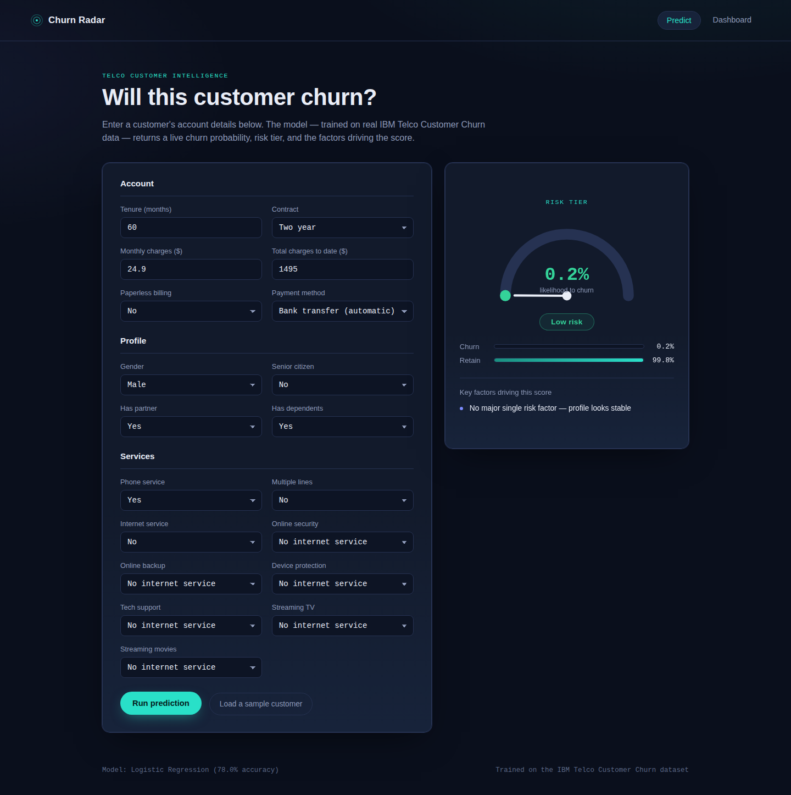
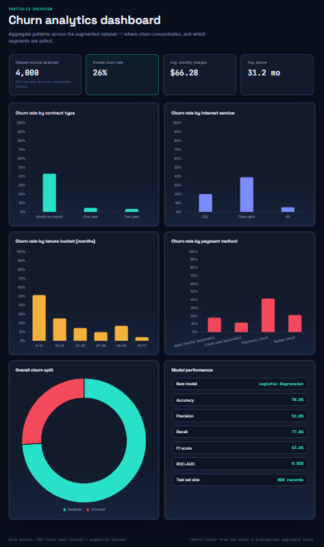

# Churn Radar — Customer Churn Prediction

An end-to-end machine learning application for predicting customer churn from telecom account, demographic, and service information.

The project combines a scikit-learn classification pipeline with a Flask REST API and an interactive web interface that provides churn probability, risk classification, contributing factors, and aggregate churn analytics.





## Overview

Customer churn is a major challenge for subscription-based businesses. This project uses customer account and service attributes to estimate the probability that a customer will discontinue their service.

The application provides:

* Real-time churn probability prediction
* Low / Medium / High risk classification
* Churn and retention probabilities
* Rule-based identification of key churn drivers
* Interactive churn analytics dashboard
* Model evaluation metrics
* REST API endpoints for predictions and dashboard data

## Tech Stack

| Category          | Technology               |
| ----------------- | ------------------------ |
| Language          | Python                   |
| Machine Learning  | scikit-learn             |
| Data Processing   | pandas, NumPy            |
| Model Persistence | joblib                   |
| Backend           | Flask                    |
| Frontend          | HTML, CSS, JavaScript    |
| Visualization     | Chart.js                 |
| Dataset           | IBM Telco Customer Churn |

## Project Structure

```text
churn_project/
│
├── app.py                         # Flask application and REST API
├── requirements.txt               # Python dependencies
├── README.md
├── .gitignore
│
├── data/
│   ├── telco_seed_real.csv        # 367 real seed records
│   ├── telco_churn_train.csv      # 3,200 training records
│   ├── telco_churn_test.csv       # 800 test records
│   └── telco_churn.csv            # 4,000-record working dataset
│
├── scripts/
│   ├── generate_dataset.py        # Dataset generation and augmentation
│   └── train_model.py             # Model training and evaluation
│
├── model/
│   ├── churn_model.pkl            # Trained scikit-learn pipeline
│   ├── metrics.json               # Model evaluation metrics
│   └── dashboard_data.json        # Precomputed dashboard statistics
│
├── templates/
│   ├── index.html                 # Prediction interface
│   └── dashboard.html             # Analytics dashboard
│
├── static/
│   ├── css/
│   │   └── style.css
│   └── js/
│       ├── chart.umd.min.js       # Chart.js
│       ├── main.js
│       └── dashboard.js
│
└── docs/
    ├── screenshot_predict.png
    └── screenshot_dashboard.png
```

## Dataset

The project is based on the IBM Telco Customer Churn dataset, which contains demographic, account, service, billing, and churn information.

The current repository contains:

* **367 real seed records**
* **3,200 training records**
* **800 test records**
* **4,000 total records in the working dataset**

The 4,000-record dataset is generated from the real seed records using row-level bootstrap resampling with controlled numerical jitter.

Therefore, the project does **not** claim that all 4,000 records represent independently collected customers.

### Dataset generation

The dataset generation pipeline:

1. Loads the real seed records.
2. Separates the records into training and testing groups.
3. Performs row-level bootstrap resampling.
4. Applies controlled variation to numerical fields such as:

   * `tenure`
   * `MonthlyCharges`
   * `TotalCharges`
5. Produces the training and testing datasets used by the model.

The generation process preserves relationships between customer attributes rather than independently sampling individual columns.

For a production-grade implementation, the full 7,043-record IBM Telco Customer Churn dataset can be used instead of the augmented working dataset.

## Machine Learning Pipeline

Two classification models are evaluated:

* Logistic Regression
* Random Forest

Both models are evaluated using a scikit-learn preprocessing and modeling pipeline.

### Preprocessing

Numerical features are processed using:

* `StandardScaler`

Categorical features are processed using:

* `OneHotEncoder`

The preprocessing and classifier are combined using a scikit-learn `ColumnTransformer` and `Pipeline`.

The model with the stronger ROC-AUC performance on the held-out test set is selected and saved using `joblib`.

### Selected model

The current trained model is:

**Logistic Regression**

with balanced class weights.

## Model Performance

Current evaluation results on the 800-record test set:

| Metric    | Score |
| --------- | ----: |
| Accuracy  | 78.0% |
| Precision | 53.8% |
| Recall    | 77.8% |
| F1 Score  | 63.6% |
| ROC-AUC   | 0.820 |

These metrics are calculated from the current augmented dataset and should not be interpreted as results from the complete 7,043-record IBM dataset.

## Application Features

### Churn Prediction

Users can enter customer information including:

* Tenure
* Contract type
* Monthly charges
* Total charges
* Billing method
* Payment method
* Demographic information
* Internet service
* Security and backup services
* Streaming services
* Technical support

The application returns:

* Churn probability
* Retention probability
* Risk level
* Key factors associated with the prediction

### Analytics Dashboard

The dashboard provides aggregate statistics and visualizations including:

* Overall churn rate
* Average monthly charges
* Average tenure
* Churn by contract type
* Churn by internet service
* Churn by tenure
* Churn by payment method
* Overall churn distribution
* Model performance metrics

## API

### `POST /api/predict`

Accepts customer information and returns a churn prediction.

Example response:

```json
{
  "prediction": "Churn",
  "churn_probability": 94.1,
  "retain_probability": 5.9,
  "risk_level": "High",
  "key_factors": [
    "Month-to-month contract",
    "Fiber optic service",
    "Electronic check payment",
    "Low customer tenure"
  ]
}
```

### `GET /api/dashboard-data`

Returns the precomputed aggregate statistics used by the dashboard visualizations.

### `GET /api/model-info`

Returns model metadata and evaluation metrics.

## Running Locally

### 1. Clone the repository

```bash
git clone <YOUR_GITHUB_REPOSITORY_URL>
cd churn_project
```

### 2. Create a virtual environment

#### Windows

```powershell
python -m venv .venv
.venv\Scripts\activate
```

#### macOS / Linux

```bash
python3 -m venv .venv
source .venv/bin/activate
```

### 3. Install dependencies

```bash
pip install -r requirements.txt
```

### 4. Start the application

```bash
python app.py
```

The application will be available at:

```text
http://127.0.0.1:5000
```

### 5. Open the application

Prediction interface:

```text
http://127.0.0.1:5000/
```

Analytics dashboard:

```text
http://127.0.0.1:5000/dashboard
```

## Retraining the Model

A pre-trained model is included in the repository, so retraining is not required to run the application.

To regenerate the dataset and retrain the model:

```bash
python scripts/generate_dataset.py
python scripts/train_model.py
```

The generated artifacts include:

```text
model/churn_model.pkl
model/metrics.json
model/dashboard_data.json
```

## Project Architecture

```text
Customer Input
      │
      ▼
Web Interface
      │
      ▼
Flask REST API
      │
      ▼
Preprocessing Pipeline
      │
      ├── Numerical Features
      │       └── StandardScaler
      │
      └── Categorical Features
              └── OneHotEncoder
      │
      ▼
Logistic Regression
      │
      ▼
Churn Probability
      │
      ├── Risk Level
      └── Key Factors
```

The dashboard uses precomputed aggregate statistics generated from the project dataset.

## Model Interpretability

The application does not use an LLM to generate predictions or explanations.

The prediction itself is produced by the trained scikit-learn classification pipeline.

The displayed "key factors" are generated using deterministic, rule-based logic based on customer attributes and known churn patterns in the dataset. This keeps the application fast, reproducible, and straightforward to explain during technical interviews.

## Limitations

This project is intended as a machine learning portfolio project and demonstration of an end-to-end ML workflow.

Current limitations include:

* The working dataset is augmented from 367 real seed records rather than the complete 7,043-record dataset.
* The model is trained on historical customer attributes and does not account for future behavioral changes.
* The displayed key factors are rule-based rather than SHAP- or LIME-based explanations.
* Model performance depends on the characteristics and quality of the available dataset.

## Future Improvements

Potential extensions include:

* Training on the complete 7,043-record IBM dataset
* Hyperparameter optimization
* Cross-validation and model calibration
* SHAP-based model explanations
* Customer retention recommendations
* Batch prediction through CSV upload
* Model monitoring and drift detection
* Cloud deployment
* Authentication and role-based access
* Automated retraining pipeline

## Author

**Mimansha Singh**

Built as a machine learning portfolio project demonstrating data preprocessing, supervised learning, model evaluation, REST API development, and frontend integration.
